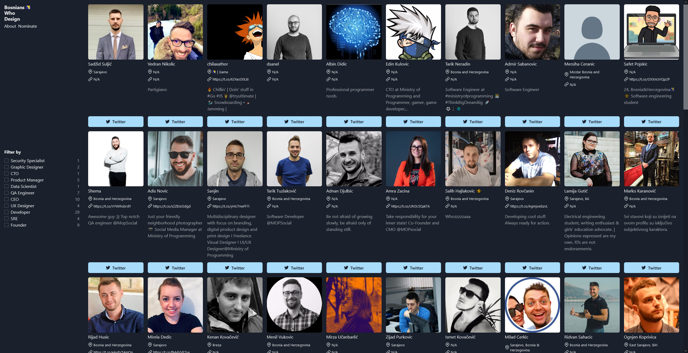

# [bosnianswho.design](https://www.bosnianswho.design/) 🇧🇦

[](https://github.com/prettier/prettier)
[](https://github.com/malcodeman/bosnianswho.design/blob/master/LICENSE)

Bosnians Who Design is a directory of accomplished Bosnians and Herzegovinians in the IT industry.



## Getting started

```
git clone https://github.com/malcodeman/bosnianswho.design
cd bosnianswho.design
yarn install
yarn dev
```

.env.development.local:

```
TWITTER_TOKEN=token
```

## License

[MIT](./LICENSE)
